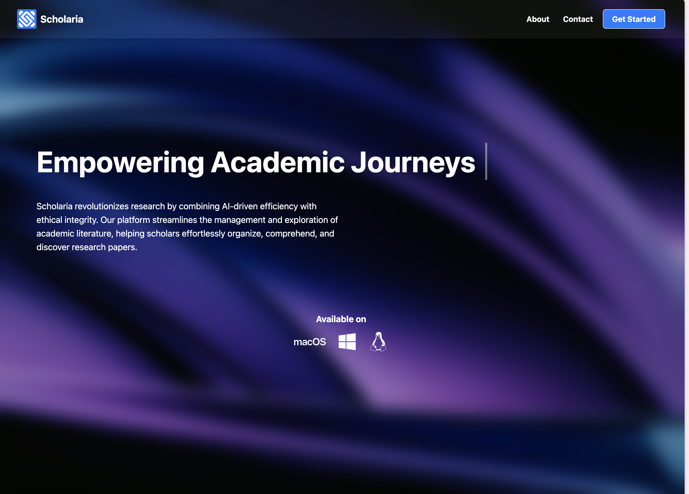

# ScholarIA - Your All-in-One Research Assistant

    

## Introduction

ScholarIA is an innovative all-in-one research assistant designed to streamline academic research. Our mission is to empower researchers by automating tedious tasks, allowing them to focus on what truly matters: advancing knowledge. With our tool, users can easily manage paper libraries, receive personalized recommendations, and take notes on articles—all within an intuitive, user-friendly interface.

 
This tool was built as part of a joint project at UPC.

    

---

## Organizational Philosophy

We believe in:

- **Customer-Centric Focus:** Prioritizing the needs of our users over the product itself.
- **Global Vision:** Serving researchers worldwide with a tool that simplifies their workflow.
- **Diversity in Thought and Experience:** Our team represents four continents, bringing diverse perspectives and ideas to the table.

**Team Members:**

- **Berat Furkan Koçak**
- **Maria Camila Salazar**
- **Mohamed Louai Bouzaher**
- **Rana İşlek**
- **Simon Coessens**

    

---

## Product Overview

ScholarIA offers a comprehensive suite of tools for academic research:

1. **Paper Library Management:** Organize and search through your academic papers seamlessly.
2. **Recommendations + Alerts:** Personalized suggestions for new research papers based on your reading patterns.
3. **Reading Assistant:** Summarizes papers and supports quick note-taking for efficient information capture.
4. **LLM Features:** Language model-driven functionalities to enhance the research experience.

Our unique recommender algorithm uses the semantic intersection of any paper in your workspace, providing accurate and context-aware suggestions.

---

## Competitive Advantages

1. **All-in-One Solution:** Combines paper organization, recommendations, summarization, and note-taking.
2. **User-Friendly Design:** An interface that prioritizes simplicity and ease of use.
3. **Market Knowledge:** Backed by thorough market research and customer engagement.

---

## Market Research & Analysis

We conducted in-depth research to understand the academic research tools market:

- **Target Audience:**
  - Professors and researchers in universities
  - Master's and PhD students
  - Industry professionals who rely on academic literature
- **Market Trends:**
  - Growing demand for tools that automate research workflows
  - Increased reliance on digital solutions for academic tasks

### Survey Insights

- **Respondent Profile:**
  - 57% Master's/PhD students, 26% Professors, 17% Other roles
  - Geographic Distribution: 78% Europe, 22% LATAM
- **Reading Habits:**
  - 70% of users read 5-20 articles monthly
  - Over 70% already use software for managing academic papers (Mendeley, Google Scholar, etc.)

### Pricing Model

We adopt a freemium model with tiered subscription options:

| Plan             | Price             |
| ---------------- | ----------------- |
| **Individual**   | $5/month          |
| **Student**      | $3/month          |
| **Universities** | $2/month per user |

_University bulk subscription:_ We aim to secure 12,500 users at €2/month to reach a monthly revenue target of €25,000, achievable with just 12 university partnerships.

---

## Product Demo

Try ScholarIA in action! Experience the ease of managing your academic research with personalized recommendations and note-taking.

---

## Check Out the App

Visit [ScholarIA App](https://scholaria-app.vercel.app/landing) to start using the app today!

---

## Acknowledgments

Special thanks to our BDMA partners and supporting universities.
